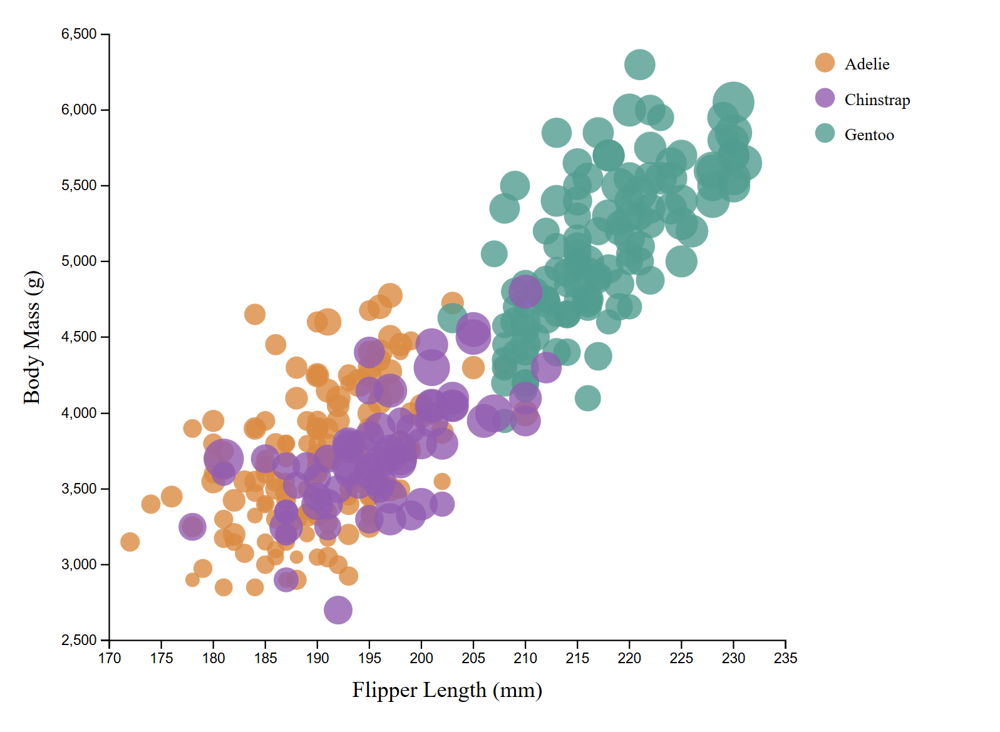
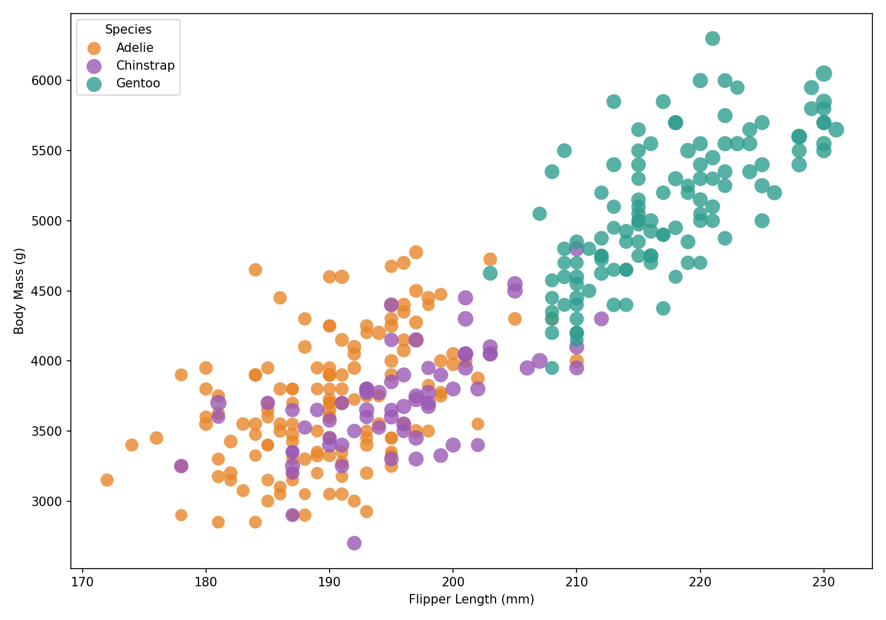
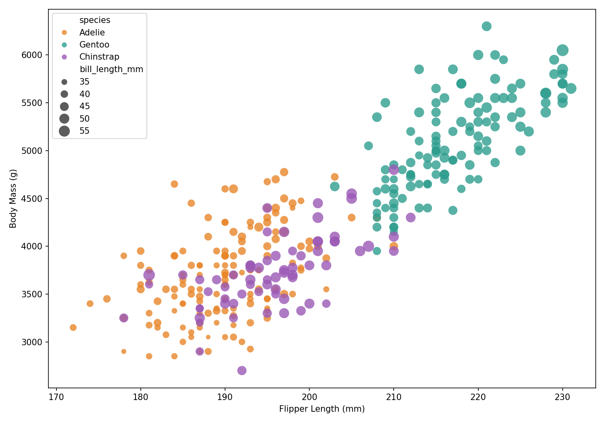
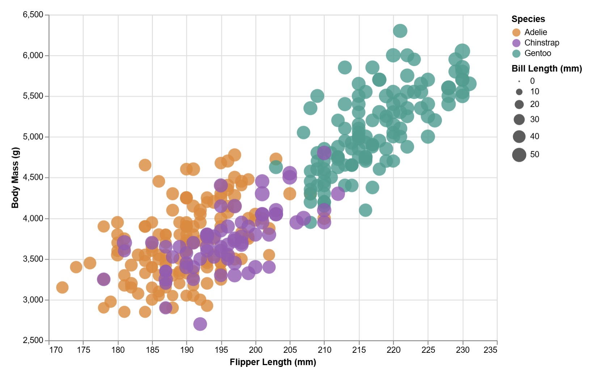
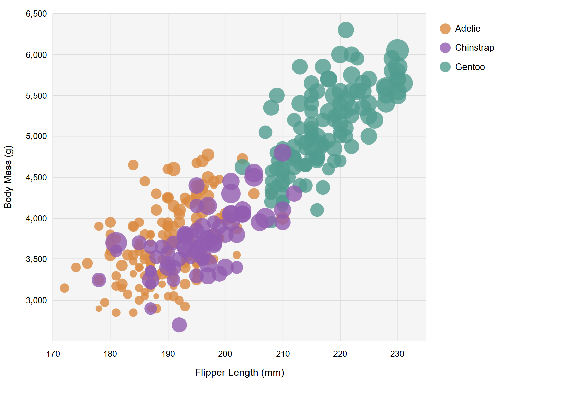

# Assignment 2 - Rohit Tallapragada

## Description

For this assignment, I made a penguin scatterplot using 5 different visualization tools. The chart plots Flipper Length by Body Mass. Color is mapped to species and circle size mapped to bill length. All circles have an opacity of 0.8.

## Tools Chosen

# D3.js

I used D3's `d3.scaleLinear()` for the scales, and `d3.axisBottom()` / `d3.axisLeft()` for the axes. Color is mapped using an object lookup. Each one of the circles has a `<title>` element that shows a tooltip on hover with the penguin's details for interactivity.

# Python + Matplotlib

I used `ax.scatter()` in a loop grouped by species to apply different colors. The `s` parameter maps bill length to circle size and `alpha=0.8` sets opacity. Compared to the D3 implementation, this version was a lot more simple, and the only tricky part was that `s` uses area in points² so I had to multiply bill length by 3 so the dots would actually look good.

# Python + Seaborn

Seaborn just wraps matplotlib with a higher-level API, so it was also really simple with the least code of any of the tools. I used `sns.scatterplot()` call with `hue`, `size`, and `alpha` parameters produces the full chart including a legend.

# Vega-Lite

Vega-Lite uses a JSON to define the chart, so I barely needed to add any extra code compared to the other tools (other than Seaborn). Tooltips are built in by adding a `tooltip` encoding. However, since it uses CDN I'm not sure it's possible to get Vega-lite to work without some sort of internet connection (or at least, I couldn't figure one out)

# Python SVG Generation

This approach generates SVG markup from Python using only pandas for data loading. This was the longest and most complicated tool to use since every pixel position has to be calculated and I wasn't using any library dependencies.

## Technical Achievements

1. **D3 Tooltips**: Each circle in the D3 visualization has a `<title>` element that shows species, flipper length, body mass, and bill length on hover.

2. **Vega-Lite Tooltips**: The Vega-Lite implementation has tooltip encoding so you can hover over points to see their details of the penguin.

## Design Achievements

1. **Colors**: All five visualizations use the same color mapping so it's easier to compare and contrast their major differences.

**AI Usage**: Chatgpt 4o (free) was used to give me instructions on how to format this README, specifically things like bolded lettering, text headers, and embedding screenshots.